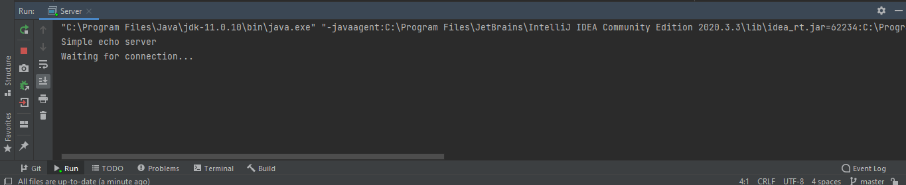
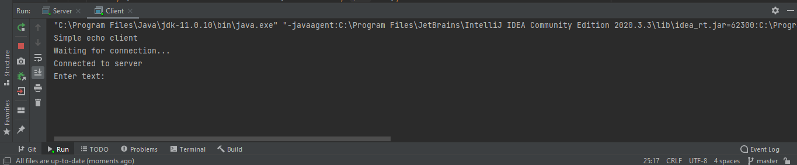
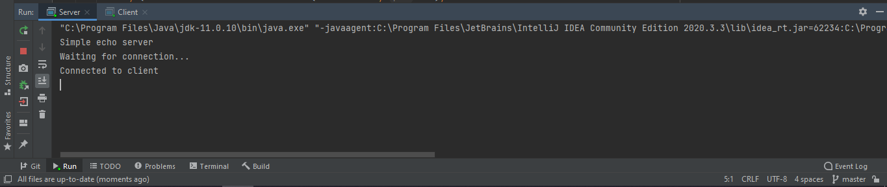
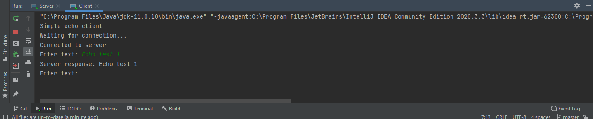
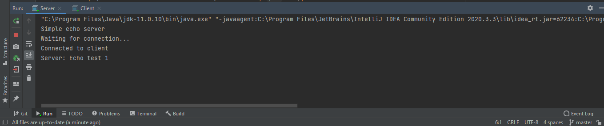
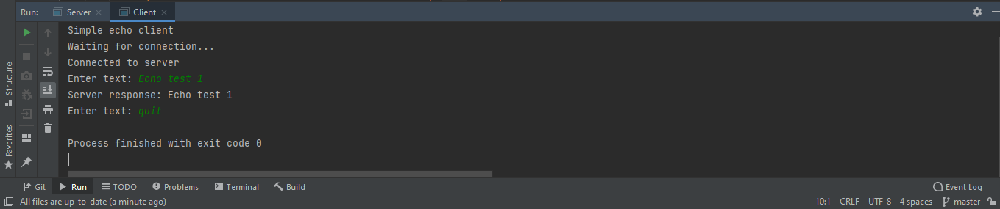
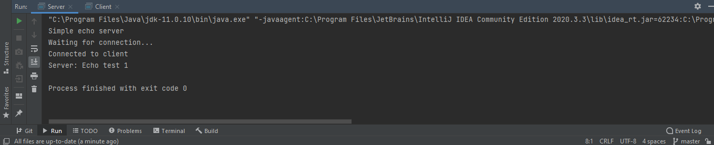

## ClientServer_echo_example
Simple client-server echo program <br/>
Source: https://subscription.packtpub.com/book/application_development/9781785885471/1/ch01lvl1sec11/creating-a-simple-echo-server <br/>
Book: Learning Network Programming with Java By Richard M Reese
### Creating a simple echo server
We will start with the definition of the <code>Server</code> class as shown next. In the <code>main</code> method, an initial server message will be displayed:

```java
public class Server {
    public static void main(String[] args) {
        System.out.println("Simple echo server");
        ...
    }
}
```

The remainder of the method's body consists of a series of try blocks to handle exceptions. 
In the first try block, a <code>ServerSocket</code> instance is created using <code>6000</code> as its parameter. 
The <code>ServerSocket</code> class is a specialized socket that is used by a server to listen for client requests. 
Its argument is its port number. The IP of the machine on which the server is located is not necessarily of interest to the server, 
but the client will ultimately need to know this IP address. <br/>

In the next code sequence, an instance of the <code>ServerSocket</code> class is created and its <code>accept</code> method is called.
The <code>ServerSocket</code> will block this call until it receives a request from a client.
Blocking means that the program is suspended until the method returns. When a request is received, the <code>accept</code> method will return a <code>Socket</code> class instance, which represents the connection between that client and the server. 
They can now send and receive messages:

```java
try (ServerSocket serverSocket = new ServerSocket(6000)){
            System.out.println("Waiting for connection...");
            Socket clientSocket = serverSocket.accept();
            System.out.println("Connected to client");
         ...
    } catch (IOException e) {
            e.printStackTrace();
    }
```

After this client socket has been created, we can process the message sent to the server. 
As we are dealing with text, we will use a <code>BufferedReader</code> instance to read the message from the client. 
This is created using the client socket's <code>getInputStream</code> method. We will use a <code>PrintWriter</code> instance to reply to the client. 
This is created using the client socket's <code>getOutputStream</code> method, shown as follows:

```java
try (BufferedReader bufferedReader = new BufferedReader(
                    new InputStreamReader(clientSocket.getInputStream()));
                 PrintWriter out = new PrintWriter(clientSocket.getOutputStream(), true)){
                 ...
        }
    }
```

The second argument to the <code>PrintWriter</code> constructor is set to <code>true</code>. 
This means that text sent using the <code>out</code> object will automatically be flushed after each use.
When text is written to a socket, it will sit in a buffer until either the buffer is full or a flush method is called.
Performing automatic flushing saves us from having to remember to flush the buffer, but it can result in excessive flushing,
whereas a single flush issued after the last write is performed, will also do.
The next code segment completes the server. The <code>readLine</code> method reads a line at a time from the client. 
This text is displayed and then sent back to the client using the <code>out</code> object:

```java
String inputLine;
while ((inputLine = bufferedReader.readLine()) != null) {
    System.out.println("Server: "+ inputLine);
    out.println(inputLine);
}
```

Complete server code:

```java
import java.io.BufferedReader;
import java.io.IOException;
import java.io.InputStreamReader;
import java.io.PrintWriter;
import java.net.ServerSocket;
import java.net.Socket;

public class Server {
    public static void main(String[] args) {
        System.out.println("Simple echo server");

        try (ServerSocket serverSocket = new ServerSocket(6000)){
            System.out.println("Waiting for connection...");
            Socket clientSocket = serverSocket.accept();
            System.out.println("Connected to client");

            try (BufferedReader bufferedReader = new BufferedReader(
                    new InputStreamReader(clientSocket.getInputStream()));
                 PrintWriter out = new PrintWriter(clientSocket.getOutputStream(), true)){
                String inputLine;
                while ((inputLine = bufferedReader.readLine()) != null) {
                    System.out.println("Server: "+ inputLine);
                    out.println(inputLine);
                }
            }
        } catch (IOException e) {
            e.printStackTrace();
        }
    }
}

```

Before we demonstrate the server in action, we need to create a client application to use with it. <br/>

### Creating a simple echo client 

We start with the declaration of a <code>Client</code> class where in the <code>main</code> method, a message is displayed indicating the application's start that is shown as follows:

```java
public class Client {
    public static void main(String args[]) {
        System.out.println("Simple echo client");
        ...
    }
}
```

A <code>Socket</code> instance needs to be created to connect to the server.
In the following example, it is assumed that the server and the client are running on the same machine. 
The <code>InetAddress</code> class' static <code>getLocalHost</code> method returns this address, which is then used in the <code>Socket</code> class's constructor along with port <code>6000</code>. 
If they are located on different machines, then the server's address needs to be used instead. 
As with the server, an instance of the <code>PrintWriter</code> and <code>BufferedReader</code> classes are created to allow text to be sent to and from the server:

```java
try {
            System.out.println("Waiting for connection...");
            InetAddress localAddress = InetAddress.getLocalHost();

            try (Socket clientSocket = new Socket(localAddress, 6000);
                 PrintWriter out = new PrintWriter(clientSocket.getOutputStream(), true);
                 BufferedReader bufferedReader = new BufferedReader(new InputStreamReader(
                         clientSocket.getInputStream()))){
                         ...
        }
    } catch (IOException e) {
            e.printStackTrace();
    }
```

The user is then prompted to enter text. If the text is the quit command, then the infinite loop is terminated, and the application shuts down.
Otherwise, the text is sent to the server using the <code>out</code> object. 
When the reply is returned, it is displayed as shown next:

```java
System.out.println("Connected to server");
Scanner scanner = new Scanner(System.in);
while (true){
    System.out.print("Enter text: ");
    String inputLine = scanner.nextLine();
    if ("quit".equalsIgnoreCase(inputLine)){
         break;
    }
    out.println(inputLine);
    String response = bufferedReader.readLine();
    System.out.println("Server response: "+ response);
}
```                
Complete client code:

```java
import java.io.BufferedReader;
import java.io.IOException;
import java.io.InputStreamReader;
import java.io.PrintWriter;
import java.net.InetAddress;
import java.net.Socket;
import java.util.Scanner;

public class Client {
    public static void main(String[] args) {
        System.out.println("Simple echo client");

        try {
            System.out.println("Waiting for connection...");
            InetAddress localAddress = InetAddress.getLocalHost();

            try (Socket clientSocket = new Socket(localAddress, 6000);
                 PrintWriter out = new PrintWriter(clientSocket.getOutputStream(), true);
                 BufferedReader bufferedReader = new BufferedReader(new InputStreamReader(
                         clientSocket.getInputStream()))){
                System.out.println("Connected to server");
                Scanner scanner = new Scanner(System.in);
                while (true){
                    System.out.print("Enter text: ");
                    String inputLine = scanner.nextLine();
                    if ("quit".equalsIgnoreCase(inputLine)){
                        break;
                    }
                    out.println(inputLine);
                    String response = bufferedReader.readLine();
                    System.out.println("Server response: "+ response);
                }

            }

        } catch (IOException e) {
            e.printStackTrace();
        }
    }
}
```
These programs can be implemented as two separate projects or within a single project. 
Either way, start the server first and then start the client. 

Output

|start Server|
|---|
||

|start Client. Client connects to client already running|
|---|
||

|Server connected to client|
|---|
||

|Entering text <code>Echo Test 1</code> in client side|
|---|
||

|Server side response|
|---|
||

|<code>quit</code> terminates the program|
|---|
||

